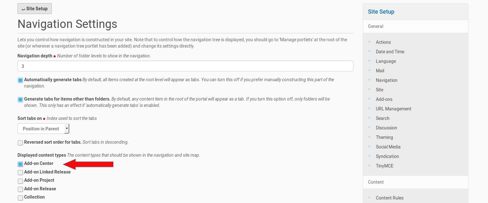

=================
collective.addons
=================

User documentation

Installation
############

You first need to install and activate the Plone add-on. Therefor you had to go to the
Plone 'Site Setup' adminstration area. If you got administration permissions you find a
link to it in the menu entry with your name (or 'admin'). You could reach it directly by
adding '/@@overview-controlpanel' to the URL of your Plone site.

In the 'Site Setup' page click on 'Add-ons' and you get a list of the Plone add-ons which
are available in your Plone site.

.. image:: source/images/install_collective_addon.png
   :width: 600

You will get a list like in the above screenshot. Click on the 'install' button next to
the 'collective.addons' list entry and the add-on will be installed in your Plone site.

Navigation configuration
************************

Next you need to go to the 'Navigation' configuration inside the 'Site Setup'. Thus click on
the corresponding button and you get to the configuration menu in the screenshot below.

Tick the checkbox in fron of the entry 'Add-on_Center' and save your changes. The necessary steps
are done to go to the homepage of your Plone site (or a subdirectory of the site, where you want to
create a new add-on center.

Add A New Add-on Center To Your Plone Site
##########################################

I assume you want to add the center to the Plone site root ('Home'). Therefor go to this site root and
choose from the Plone menu on the left 'Add new'. You get in this menu an entry to create a new
'Add-on Center' (see the screenshot below).

.. image:: source/images/create_addon_center.png
   :width: 600

Click on this entry and you get the form below. This is the edit form to create and configure a new
Add-on Center in your Plone site.

.. image:: source/images/addon_center_form01.png
   :width: 600

Fill in the fields in the edit form of the Add-on Center. All fields has a description of their expected values.
Don't miss to go through the register of the edit form dialog. The fields on the register 'Allowed file extensions'
need your input about the allowed file extensions for the add-ons, the image file extensions (logo, screenshot) and
the documentation files. If there are different file extensions allowed for this file categories you could enter
this file extensions seperated by a pipe into the form fields, e.g.: 'pdf|odt' for documentation files.
Once you are finished with adding values to the edit form, save the form. If you missed to edit a form field,
you will get an error message and could fill in the necessary information into the appropriate form field.
