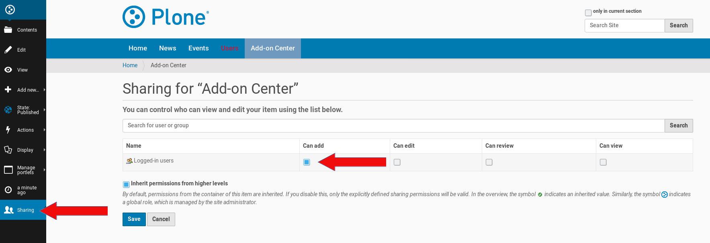

Add A New Add-on Center To Your Plone Site
##########################################

I assume you want to add the center to the Plone site root ('Home'). Therefor go to this site root and
choose from the Plone menu on the left 'Add new'. You get in this menu an entry to create a new
'Add-on Center' (see the screenshot below).

.. image:: images/create_addon_center.png
   :width: 600

Click on this entry and you get the form below. This is the edit form to create and configure a new
Add-on Center in your Plone site.

.. image:: images/addon_center_form01.png
   :width: 600

Fill in the fields in the edit form of the Add-on Center. All fields has a description of their expected values.
Don't miss to go through the register of the edit form dialog. The fields on the register 'Allowed file extensions'
need your input about the allowed file extensions for the add-ons, the image file extensions (logo, screenshot) and
the documentation files. If there are different file extensions allowed for this file categories you could enter
this file extensions seperated by a pipe into the form fields, e.g.: 'pdf|odt' for documentation files.
Once you are finished with adding values to the edit form, save the form. If you missed to edit a form field,
you will get an error message and could fill in the necessary information into the appropriate form field.

Publish The New Add-on Center
*****************************

Once you finished with the edit form of the Add-on Center and saved your changes you need to publish the center.
You could do this by a click on the entry 'State: Private' in the menubar on the left site. Choose the entry 'Publish'
and you are done.

Sharing: Enable Members To Add Projects
***************************************

The logged in users are not able to add projects to the Add-on Center yet. You could enable this by a mouse click
on the entry 'Sharing' in menubar on the left site (see screenshot below). This shows the edit menu for sharing
and you could tick the checkbox 'Can add' for 'logged-in-users' (see screenshot below) to enable the members of the Plone site to add their add-on projects to the center.

