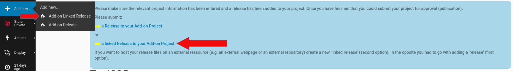
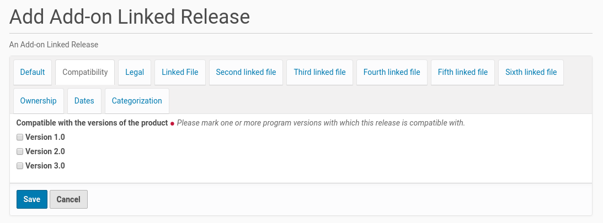

Add A New Linked Release To An Add-On Project
#############################################

Linked releases put the add-on project owner into the position to host release
files on external ressources, e.g. his own webspace or another website. Whilst
the owner is logged-in to the Plone site there is a link at the top of an
add-on project page. Once he clicked on this link (see screenshot below)
he got an edit form to enter the content of the new linked release.

The owner could make alternatively a mouse click on the menu entry 'Add new' in
the menu bar on the left side and choose from the opening sub menu the entry
'Add-On Linked Release' (see the small red arrow in the screenshot above).

The form dialog consists of several register. The form fields in the first
register asks for more general information about the release. It's possible
to edit and change the content of the fields later, if there is something
missing or there are e.g. typos, which should be fixed.

The First Register 'Default'
****************************

The new add-on linked release needs its own release number. This number
(up to twelf chars) will be part of the linked release title and its URL. The
title will be created from the add-on project title and the linked release
number. This title has to be unique inside the Plone site. If the linked
release number is already in use, the editor will get an error message about
it.

.. image:: images/addon_linked_release_form01.png
   :width: 650

A new linked release needs also a summary and could get a full release
description with details about its features. The latter one is optional
(only form fields with a red point behind the title are mandatory).

There is also an optional field to add changelog information, especially if
the add-on linked release adds some new features or fix some issues.

The field for the email address will be initialized with the email address
from the add-on project the linked release was added to.

The Second Register 'Compatibility'
***********************************

This register contains a form field to choose the versions of the program the
linked release is compatible with. The list of program versions will be
created by the site admin within the 'Add-on Center'. It is possible to
choose multiple program versions for the release compatibility.

The Third Register 'Legal'
**************************

The third register shows the necessary fields for the legal statements about
the linked release. It starts with the license for the linked release. It is
possible to check more than one license for a linked release. This declaration
need to be in accordance with the license declaration inside the
add-on linked release (if there is one).

.. image:: images/addon_linked_release_form03.png
   :width: 650

There is also a read-only form field which contains the text of the legal
disclaimer that has to be accepted by the add-on linked release owner. The
text of the legal disclaimer will be set by the site admin inside the
'Add-on Center'.

If the source code is not inside the add-on linked release (the drop down
field is set to 'No'), it is necessary to fill in the link to the source code
in the form field at the bottom of the register. If such a link will not be
submitted the linked release owner gets an error message.

The Fourth Register 'Linked File'
*********************************

This register is the place to link to the add-on linked release file and
declare which platform it is compatible with.

.. image:: images/addon_linked_release_form04.png
   :width: 600

If there are versions of the add-on linked release for different platforms
(e.g. one for MS Windows and another one for Linux only) this further linked
release files could be linked using the following register.

The list of platforms in the listing below the the upload field will be created
by the site admin inside the 'Add-on Center'. She / he is able to expand this
list at any time if desired.

Because a linked release is not uploaded to the Plone website it is not
possible for Plone to calculate the size of the add-on linked release file.
Thus there is a form field to submit this size of the file. This information
will be displayed in the website next to the download link for the linked
release file.
